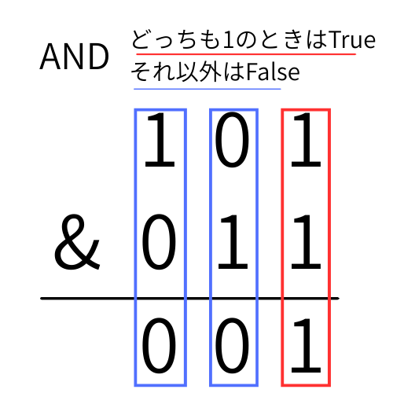
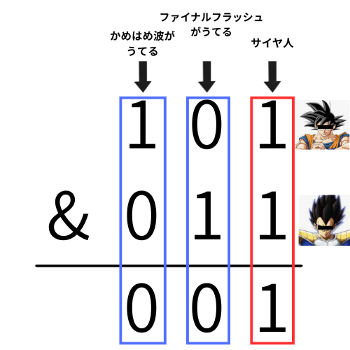
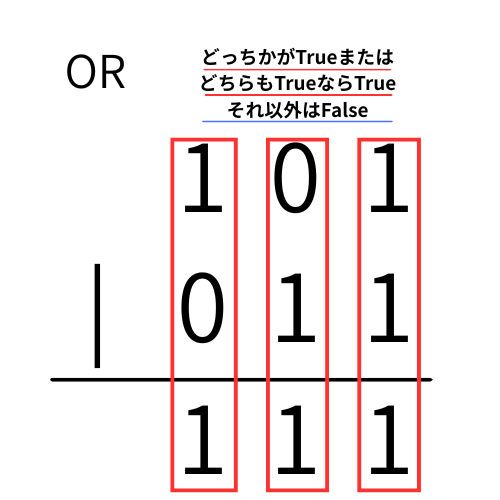
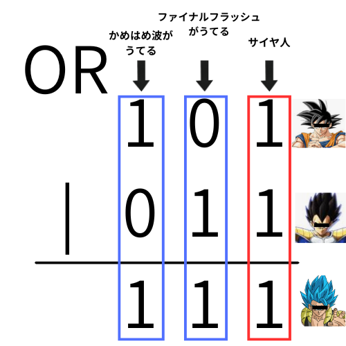
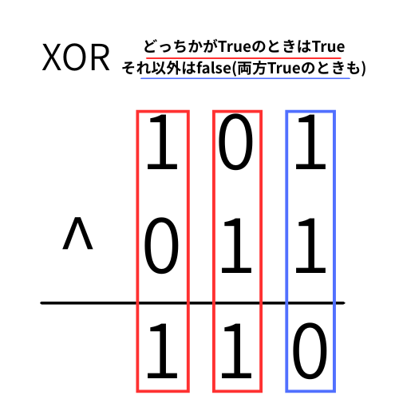
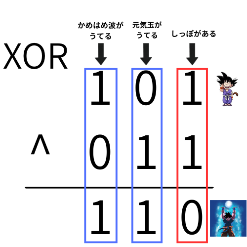

# pythonでビット演算をしてみる

## 大前提: 二進数･ビット/バイト
コンピュータはすべてを二進数で処理をしているという話は、よく聞くと思う。

### ビット(bit)とバイト(byte)
この2つの用語が似てるのが、情報初学者の大きな混乱の元。この名前考えた人アホじゃねーのと先生も思う。けど、しゃーない。

2進数の**桁数**を表すのが**ビット(bit)**
8桁のビットのかたまりが**1バイト(byte)**
英単語にしたときに、長い方(byte)の方が大きい、とおぼえとくといいかも。

例えば
101 という2進数は
```
整数でいうところの 2^2 + 2^0 = 5  
3桁の2進数→3ビット
```
となる。

さて、3ビットの桁数で、何種類のデータが表せる?
こたえは
```
000
001
010
011
100
101
110
111
```
の8通り。

情報の勉強をし始めると、興味がない人はこの辺で｢だから何やねん｣となりがちだけど、ゲームで考えてみよう。

RPGでプレイヤーの状態を管理するシステムを作ってみよう。
今回は3ビットなので、ビットごとに状態を管理する感じ。
左から、毒状態かどうか、必殺技が打てるかどうか、生きてるかどうかを管理するとする。
|2進数| 毒状態 | 必殺技 | 生きてるかどうか | 状態 |
| --- |--- |--- |--- |--- |
| 101 | True | False | True | 毒状態で、生きてる |
| 011 | False | True | True | 必殺技が打てる状態で、生きてる |
| 000 | False | False | False | 死んでる |
| 111 | True | True | True | 毒 + 必殺技打てる + 生きてる |
| 001 | False | False | True | ただ、生きてる |


### pythonで2進数を見てみよう

いちいち2進数に変換するのは大変なので、pythonに変換してもらおう
```python
numA = 5
numA_bin = bin(numA)

numB = 7
numB_bin = bin(numB)

# 0bがつくことで、コレが2進数であることを意味する
print(numA_bin)   # 0b101
print(numB_bin)   # 0b111
```
さて、ここで、pythonの論理演算子の話を思い出してみよう
```python
weather_hare = True

dayoff = True  # dayoff:休日


# 両方Trueだったら実行される
if weather_hare and dayoff:
    print("遊びに行こう")
```
andの場合は、右も左もTrueの場合実行される
ここで
```
print(weather_hare and dayoff)
```
とすると、Trueがprintされる。
True and True => True

もう一つの論理演算子、orを思い出してみる
```python
netsu_38 = True

seki = False

if netsu_38 or seki:
    print("病院に行こう")
```
orの場合は、右か左のどちらかがTrueの場合実行される
ここで
```python
print(netsu_38 or seki)
```
とすると、Trueがprintされる。
True or False => True

### Trueは 1、 False は 0
pythonで、以下のコードを実行してみると、面白いことがわかる
```python
print(1 == True)  # True
print(3 == True)  # True
print(0 == True)  # False
```
pythonでは、0以外の数値はTrue、0はFalseと同じになる。(細かく言うと語弊があるので注意。クラスが違う。)

だから例えば、こういうコードを書くと、0のときこれ、それ以外のときはこれ、という条件分岐ができる
```python
score = 0

if not score:
    print("ゲームが始まっていません")

else:
    print(f"ゲームが始まりました。現在の特典なh{score}点です")
```

これは、0と1の2進数でしか理解できないコンピュータの特性を、TrueとFalseを使い分ける処理をうまく利用しているわけなんだけど、とりあえずTrue/Falseと1/0は同じだと思っておいて。

## では、ビット演算とは何なのか
平たく言うと、**2進数の0と1を操作するやり方** なんだけど、この話をするとき避けて通れないのが。｢だから何?何がうれしいの?｣という感情。後でちゃんと説明するので、ちょっと我慢しておくれ。


まず、さっきはpythonの例で**論理演算子**を使ったけど、ビット演算ではそれにかわって**ビット演算子**を使う。
この表見てもなんのこっちゃ、って感じだろうけど、後で戻ってこよう。

| num1	| num2	| `&` : AND（論理積）| `\|`: OR（論理積）| `^` : XOR（排他的論理和）|
| --- | --- | --- | --- | --- | 
| 101 <br> (5) | 011 <br> (3) | 001<br>(1) | 111<br>(7) | 110<br>(6) |
| 110<br>(6) | 001<br>(1) | 000<br>(0) | 111<br>(7) | 111<br>(7) |
| 010<br>(2) | 011<br>(3) | 010<br>(2) | 011<br>(3) | 001<br>(1) |

### ①AND 演算子: どっちも1=Trueだったら、1  それ以外は0

ビット演算を考えるときに、小学校で習った筆算を思い出してみよう。同じ桁同士を並べて計算するあのやり方、ビット演算を理解するのにとってもいい。

AND演算子は、同じ桁の療法が1だったときのみ 1になって、それ以外は0になる
･･･って言われても、だから何に使うの?ってなるだろう

#### 悟空とベジータ: 共通点を探してみよう
地球にはじめて、ベジータくんがやってきたよ!宇宙からひた人に会うのはたのしみだけど。ぼくたちなかよくできるかな? まずはお互いのおんなじところをさがしてみよう!

ということで、こんな感じで悟空たちを2進数に(?)してみよう



やったね!僕達おんなじサイヤ人!!お友達になろうね!!

こうして地球の平和は守られたのであった。
次回、悟空死す!!

### ②OR 演算子:どっちかが1 もしくは両方1なら1 それ以外は0


OR演算子は、同じ桁の片方が1、あるいは両方が1のときに1になる
これまたドラゴンボールで考えてみる。

#### 地球がピンチ!フュージョンで合体しよう!
俺達マブだぜ!フュージョンしてブロリーを倒そう!
合体して弱くなったら意味ないから、ボタラ(OR演算子)を使おうぜ!!


### ③XOR 演算子: どちらか片方が1なら1、両方0または両方1のときはFalse


OR演算子と違うところは、両方1のときに0になること。
このXOR、なにに使うのか、コレだけだとイメージしづらいと思うけど結構便利。
よく使われるやり方として、特定のビットを反転(0->1 1->0)させることができる。
↑の図で、2列目の011に注目してみよう。その中でも特に`11`の部分に注目。1の上のビットと下のビットが、必ず逆になっていることがわかる。逆に0は上が1だろうが0だろうが必ず0を返す。
つまり、たとえば10101111という二進数の一番右のビットを0にして、10101110にしたいときは、一番最後のビットに対してXORで1を当てればいいので、
10101111 ^ 00000001 = 10101110
となる。

これをドラゴンボールで考えてみようと思ったけど、悟空とベジータで考えるとちょっと無理がありそうなので、悟空に絞って考えてみる。

#### 元気玉を覚えよう
界王様に新しい技を教えてもらったぜ!ということで、元気玉を覚える前の悟空から、元気玉を覚えたあとの悟空に、ビット演算をつかってアップデートしていこう。
あと、悟空は子供の頃尻尾が会ったけど、


こんな感じで、変更したいビットに1を当ててやると、ビット反転で特定のビットだけを逆にできる。
ちなみに、｢元気玉｣は英語で｢Spirit bomb｣ 直訳すると｢魂爆弾｣ なんかイメージ違うよねw

## なんとなくわかったような気がしないでもないけど、だからなんなのよ
という感想を持つのは至極当然。こんなの、情報系の学部とかに行かなければこの先一生意識する必要のない人もいる。でも、大学受験等でどうしても理解しなくちゃいけない人もいたり、将来ゲーム制作をして使う人もいるかも知れない。

さっきの悟空とベジータの例を、まずはビット演算無しでpythonで書いてみよう。

```python
gokuu = {
    "かめはめ波": True,
    "ファイナルフラッシュ": False,
    "サイヤ人": True,
}

vegita = {
    "かめはめ波": False,
    "ファイナルフラッシュ": True,
    "サイヤ人": True,
}

skills = ["かめはめ波", "ファイナルフラッシュ", "サイヤ人"]

gojita = {}

for skill in skills:
    if gokuu[skill] and vegita[skill]:
        gojita[skill] = True
    elif gokuu[skill] or vegita[skill]:
        gojita[skill] = True
    else:
        gojita[skill] = False

print(gojita)
```

### ｢消費メモリが少ない｣とはどういうことか
ビット演算をなぜ使うのか、メリットは何なのかと調べると、大体 **消費メモリが少ない\((ドヤぁ\))** とかっていう話が出てくる。
メモリがなんだかわからないのにそんなこと言われても、って感じだろうから、ちょこっとその話をしよう。

#### ROMとRAM : 2種類の記憶方式
パソコンにデータを保存するとき、2種類の保存方法がある。
例えば、仕事で使う大事なデータや、学校で提出するレポートが、パソコンの電源を落としたら消えちゃった、となると大変。こういうデータは、ずっと記憶しておける記憶装置というところに保存される(ハードディスクや。SSD)
一方で、パソコンの電源を落としたときや、必要なくなったときに消えてもいいデータというのも存在する。みんながやってるpythonの変数なんかもそう。プログラムを実行している間は消えたら困るけど、プログラムが終了したら必要無くなるから、消えても無問題。
ずっと残しておくデータを記憶しておく仕組みをROM(ロム:Read Only Memory)といって、必要なくなったら消えても問題ないデータを扱う仕組みをRAM(ラム:Random Access Memory)という。
パソコンのパーツで言うと、

ROM:ハードディスク･SSD･フラッシュメモリ
RAM:メモリ(正式名称派RAM何だけど、パーツを呼ぶゴキにメモリと呼ぶのも一般的)
※ハードディスク = ROMなのか?というのは、ややこしいので割愛
※以下、メモリのことはRAMで統一します

試しに、今パソコンでどのくらいのRAMが使われているかを見てみよう。
windowsの人は、画面下のタスクバーを右クリックして、タスクマネージャ
macの人は、スポットライト検索で｢アクティビティモニタ｣を検索
すると、こんな画面が出てくる
※windowsの画面で話を進めます


これは、アプリがどれ躯体パソコンのリソースを使っているかが書いてある。右側の｢メモリ｣と書いてある列が、さっき言ったRAMの使用量を表している。(画像だとgoogle chromeが一番RAMを使っている)

RAMは、パソコンごとに容量が決まっていて、物によっては自分でパーツを付け足して容量を増やすこともできる。パソコンを購入するときの判断基準の一つで、基本的にはRAM容量が多いものが高価で性能もいい。(家電量販店とかだとメモリ、パソコン専門店とかだとRAMとかって書いてあることが多い)

限りあるRAMの中で、上の画像だとその60%位を使っているわけだけど、イメージ的にはパソコンの本気の60R%位を使っているわけで、この数字が増えれば増えるほど、やらなくちゃいけないタスクが多いわけだから、パソコンの一つひとつの動作が遅くなったりする。100%を超えたりしたらなおさら。だから、メモリは最初から容量が多いほうが良いし、そもそもそれぞれのアプリがメモリを使わない設計になっていれば、とてもいい。

##### pythonで実装してみる:ビット演算を使わないバージョン
まず、ビット演算を使わない方式で、pythonを使ってさっきの悟空とベジータのやつを実装してみよう
```python
gokuu = {
    "かめはめ波": True,
    "ファイナルフラッシュ": False,
    "サイヤ人": True,
}

vegita = {
    "かめはめ波": False,
    "ファイナルフラッシュ": True,
    "サイヤ人": True,
}

skills = ["かめはめ波", "ファイナルフラッシュ", "サイヤ人"]

gojita = {}

for skill in skills:
    if gokuu[skill] and vegita[skill]:
        gojita[skill] = True
    elif gokuu[skill] or vegita[skill]:
        gojita[skill] = True
    else:
        gojita[skill] = False

print(gojita)
```
※この教材ではメモリ消費の多さをアピールする手段として、わざとdict型を使っています。なので、メモリ消費の観点では、dictは激重なので、ビット演算どうこうっていう話じゃないやないかい!っていうツッコミはなしの方向でお願いします!


